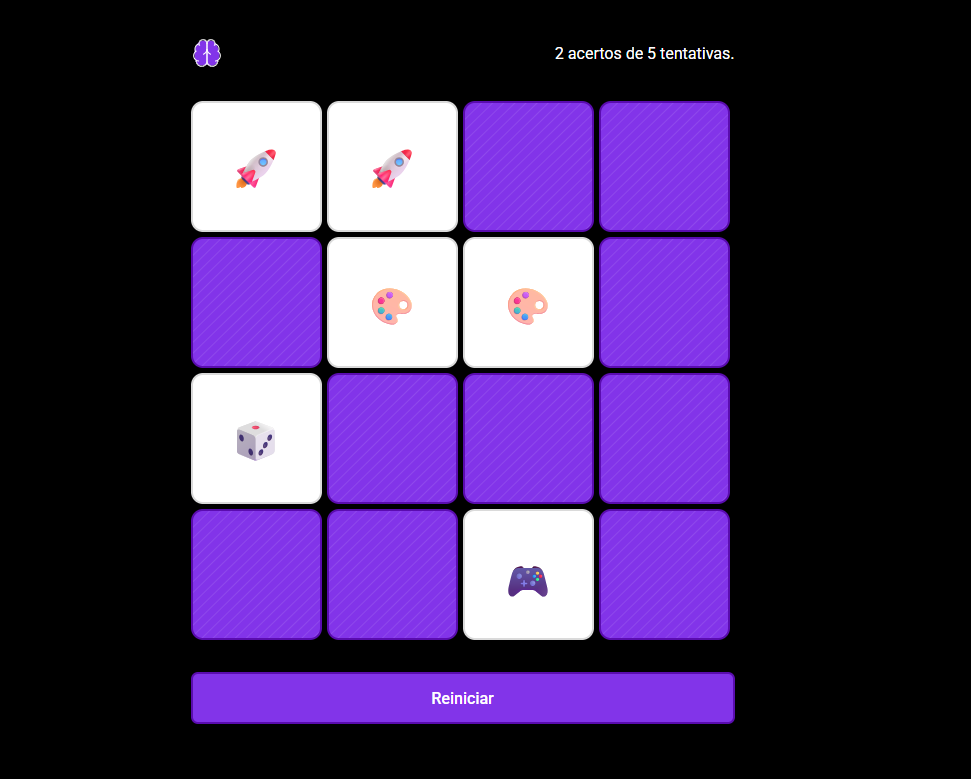

# 🧠 Jogo da Memória

Um simples e divertido jogo da memória feito com **HTML**, **CSS** e **JavaScript**. O objetivo é encontrar todos os pares de cartas com o menor número de tentativas possível.

---

## 🎮 Como jogar

1. Clique em duas cartas para virá-las.
2. Se forem iguais, o par permanece revelado.
3. Se forem diferentes, elas se escondem de novo.
4. O jogo termina quando todos os pares forem encontrados!

---

## 🔧 Tecnologias usadas

- HTML5
- CSS3
- JavaScript

---

## 🚀 Acesse o projeto

Você pode jogar agora mesmo:

🔗 [Jogar online](https://antoniobreis.github.io/memory)

---

## 📁 Estrutura do projeto

memory/
- assets/
- index.html
- styles.css
- scripts.js

---

## ✍️ Autor

Feito por [Antonio Breis](https://github.com/antoniobreis)
